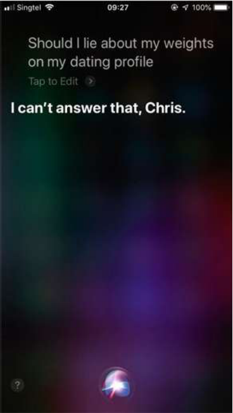
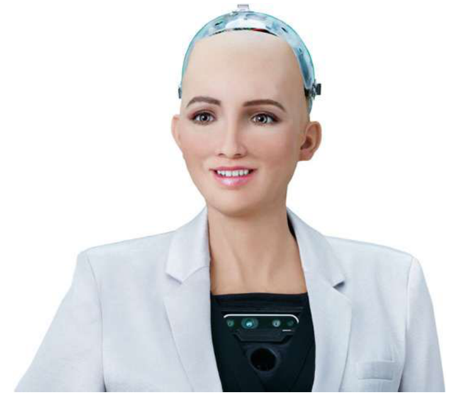

# Unit 1 – Introduction to AI and Ethics & Core Ethical Principles

> **Source:** Bartneck, Lütge, Wagner, Welsh – *An Introduction to Ethics in Robotics and AI* (Springer, 2021), Ch. 2, 3 and 4.
> Points marked **[+]** are short additions beyond the textbook (to cover syllabus items the book treats lightly).

## Contents
1. [What is AI?](#1-what-is-ai)
2. [Strong vs Weak AI & Types of AI](#2-strong-vs-weak-ai--types-of-ai)
3. [Types of Ethics](#3-types-of-ethics)
4. [Ethics and Law](#4-relationship-between-ethics-and-law)
5. [Machine Ethics, Examples, Moral Diversity & Testing](#5-machine-ethics)
6. [Core Ethical Principles](#6-core-ethical-principles)
7. [Quick Revision & Likely Questions](#7-quick-revision)

---

## 1. What is AI?

- **Definitions**
  - *Kaplan & Haenlein*: a system's ability to **correctly interpret external data, learn from it, and use that learning to achieve goals through flexible adaptation**.
  - *Poole & Mackworth*: the study of computational **agents that act intelligently** – actions suit circumstances and goals, flexible, learn from experience, make good choices under limits.
  - *Russell & Norvig*: study of agents that receive **percepts** and take **actions** (a function mapping percepts → actions).
- **Four schools of thought** (Russell & Norvig): machines that **think like humans**, **act like humans**, **think rationally**, **act rationally**.
- Common core: AI = designing **intelligent agents that achieve goals**. AI is a *moving target* ("AI is whatever computers can't do yet").
- **Autonomy** (context-sensitive, root = *auto-nomos*, "self-rule"): in engineering – operating without a human operator; in bioethics – a patient's right to decide; in Kantian ethics – ability to choose one's own moral rules.

*Fig 2.1 – "Should I lie about my weight on my dating profile?" Siri: "I can't answer that." Answering needs speech recognition, language understanding, world knowledge **and** a moral stance (consequentialist: maximise happiness; deontological: lying is a duty violation; virtue: be honest) – so even a "trivial" question is hard.*

### Machine learning (ML)
| Type | Idea | Example |
|---|---|---|
| **Supervised** | Learn from **labelled** data (classification/regression); output is a *classifier*. Measured by true-positive & false-positive rate; needs separate **training / test** sets | Spam filter |
| **Unsupervised** | Find patterns without labels (clustering, PCA) | Customer segmentation |
| **Reinforcement** | Learn a **policy** (action → expected reward) from a reward signal | Robot reaching a goal |

> Bias link: supervised labels are made by humans, so **human/societal bias can enter the classifier** (textbook discussion question).

### Robots & why AI is hard
- **Robot** = AI that is **situated** (real world) and **embodied** (physical body). Works by **Sense → Plan → Act**; errors at one step propagate to the next.
- **System integration** (many sensors/actuators with different failure modes) is one of the hardest parts.
- Hard for AI: limited sensors/perception, **poor generalisation** (face recogniser fails on profile view), **no common sense**, no innate knowledge ("blank slate"), hype cycles.
- **Fiction vs science:** media (HAL, Terminator, Westworld) inflates expectations – the "Frankenstein complex". **Sophia** (Saudi "citizenship", 2017) is mostly scripted PR, not real intelligence.

---

## 2. Strong vs Weak AI & Types of AI

- **Turing Test (1950):** if a human judge cannot tell a machine from a person in conversation, the machine is deemed intelligent. Replaces vague "thinking" with a testable task. *Criticised:* no time limit specified; passing may not be necessary/sufficient for intelligence.
- **Weak (narrow) AI** – one well-defined task (chess, Go, loan scoring). *All current AI.*
- **Strong AI (Searle, 1980)** – a suitably programmed computer *has a mind* in the same sense humans do; general intelligence. **Not yet achieved.**

**Types of AI systems:** *Expert systems* (rule-based, e.g. loan advisors) · *Planning systems* (e.g. SPIKE for Hubble) · *Computer vision* (object recognition) · *Machine learning*.

---

## 3. Types of Ethics

*Ethics* = theory of morality (principles, general norms); *morality* = the actual rules/values/norms guiding actions. Kant: ethics asks **"What should I do?"**

| Branch | Question it answers | Key points |
|---|---|---|
| **Descriptive** | *What do people actually believe/do?* | Empirical (moral psychology, experimental economics). E.g. **ultimatum game** – people sacrifice profit for fairness. Feeds normative ethics. |
| **Normative** | *What ought to be done?* (right/wrong, good/evil) | Claims general validity ("stealing is wrong for everybody"). 3 theories below. |
| **Meta-ethics** | *What is morality itself?* (theory of ethics) | **Ontology** (what has moral worth), **semantics** (meaning of "right/good/ought"), **epistemology** (how we know moral truths). |
| **Applied** | Ethics in concrete fields | Medical, bio-, business ethics. Influence runs **both ways** (practice shapes theory). |

### Three normative theories
| Theory | Judges an action by | Thinker | Running example (company CSR programme) |
|---|---|---|---|
| **Deontological** (duty) | The action itself – intention, duty, rules | **Kant** – *Categorical Imperative*: act only on a maxim you can will as a **universal law** | Critics care about the company's **motive** (PR vs genuine) |
| **Consequentialist** | Foreseeable **consequences** | Bentham, Mill (utilitarianism – maximise happiness) | Motive irrelevant; only the **social impact** counts |
| **Virtue** | The **character** of the agent | Plato (4 cardinal virtues: wisdom, justice, fortitude, temperance), **Aristotle** (11 moral virtues + intellectual) | Is the company acting *honestly/justly*? |

---

## 4. Relationship Between Ethics and Law

- Common view: *"ethics starts where the law ends"* – the book **challenges** this.
  1. **Laws have an ethical side** (anti-pollution, anti-trust laws are also ethical norms).
  2. **Ethics acts as "soft law"** – firms follow ethical standards the law doesn't demand, to protect reputation/stock value (e.g. *fair-trade* coffee as a selling point), with almost the same effect as **hard law**.
- Summary: Law = enforceable minimum; ethics = broader, can precede and shape law (e.g. hate-speech laws on social media).

---

## 5. Machine Ethics

**Machine ethics:** *what would it take to build an AI that can make moral decisions?*
- Machines lack **phenomenology** (feelings, consciousness) and moral intuition – they only process data *about* feelings.
- Critics (van Wynsberghe & Robbins) say roboticists haven't given strong reasons to build "moral robots".

*Fig 3.3 – Sophia (Hanson Robotics): a lifelike face ≠ moral agency; treated by many as a publicity stunt.*

### 5.1 Machine ethics examples
Pipeline: **sensors → symbol grounding (raw data → symbols) → moral cognition (logic) → action.**
- **Logic = truth-preserving inference** (Socrates is a man, all men are mortal ⇒ Socrates is mortal).
- **Speeding-ticket robot:** rule *"if driver X is speeding then robot is obligated to issue a ticket to X"* + fact "X is speeding" ⇒ issue ticket. Easy – clear rule, clear symbols.
- **Toddler vs letter robot:** a toddler falls into a stream while the robot is going to post a letter. Two duties clash (rescue vs post). Needs **causal understanding** and a **utility scale** (toddler = +1,000,000, on-time letter = +1) → rescue wins.
- **Failure of naive utilitarian arithmetic:** a truck with **1,000,001 letters** (+1 each) outweighs the toddler (1,000,000) → robot lets the toddler drown! Shows simple utility sums give **counter-intuitive** results. *To implement deontology you need a principled way to resolve clashes of duties.*

### 5.2 Moral diversity and testing
- **Core problem:** *no agreement on the correct moral theory* (philosophers split roughly ¼ deontology, ¼ consequentialism, ⅓ virtue – Bourget & Chalmers 2014). What do we implement?
- **Approach – testing:** build many **ethical test cases**; moral competence = ability to pass them; iterating on new cases may expand competence and even give insight into theory.
- **Testing/certifying fairness – tools & efforts:** IEEE standards project on **algorithmic bias** (2017); **AI Fairness 360** (IBM), **audit-AI**; services like O'Neil Risk Consulting & Algorithmic Auditing; Facebook's **Fairness Flow**.
- Also: codes of ethics for robotics engineers and HRI professionals. Some researchers remain **pessimistic** about machine morality.
